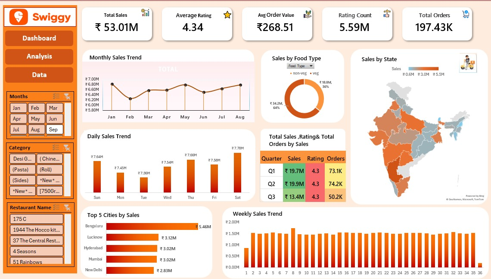

# Swiggy Sales Dashboard (Excel)

## Project Overview
This project analyzes Swiggy restaurant and order data using Microsoft Excel to uncover business insights related to restaurant performance, pricing, customer ratings, and delivery trends.

## Tools Used
- Microsoft Excel
- Pivot Tables
- Pivot Charts
- Slicers
- Conditional Formatting

## Dataset
- Swiggy Restaurant Dataset
- Cleaned and transformed before analysis

## Key Objectives
- Analyze restaurant ratings and pricing
- Identify top-performing restaurants
- Compare cuisine popularity
- Explore customer preferences
- Build an interactive dashboard

## Dashboard Features
- Restaurant Performance
- Rating Analysis
- Price Distribution
- Cuisine Analysis
- Interactive Filters (Slicers)

## Key Insights
- Identified top-rated restaurants.
- Compared pricing across different cuisines.
- Analyzed customer rating trends.
- Created an interactive dashboard for business decision-making.

## Dashboard Preview

